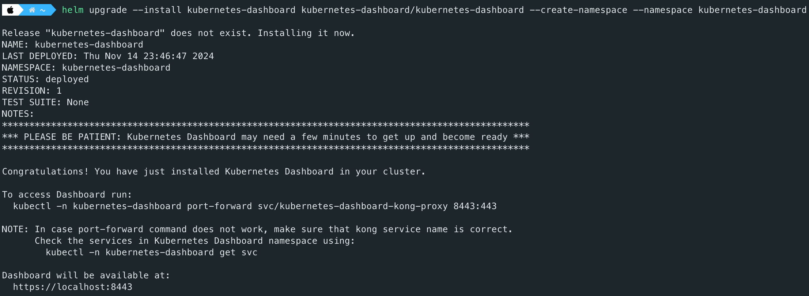
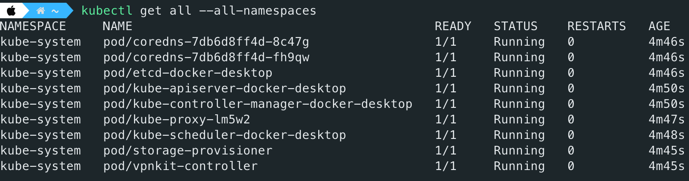

# Learning Backend

1. **User Service**: Responsible for handling user registration, login, and personal information management.
2. **Product Service**: Responsible for handling CRUD operations for products and inventory management.
3. **Order Service**: Responsible for handling order creation, payment, shipping, and refund processes.
   - Notify payment microservice:
     - if success:
       - Remove the relative items in shopping cart
       - Reduce storage
       - Send notification
     - if failure:
       - Send notification
4. **Cart Service**: Responsible for handling the creation of shopping carts, adding products, and removing products.
5. **Recommendation Service**: Responsible for recommending products based on user's purchase history and preferences.
6. **Search Service**: Responsible for handling product search functionality.
7. **Payment Service**: Responsible for handling order payments, integrating with third-party payment platforms like Alipay, WeChat Pay, etc.
8. **Notification Service**: Responsible for sending information about order status changes, event notifications, and more.

## Environment Variables

```bash
RABBITMQ_URI=<YOUR_RABBITMQ_URI>
ETCD_HOSTS=<YOUR_ETCD_HOSTS>
ETCD_USERNAME=<YOUR_ETCD_USERNAME>
ETCD_PASSWORD=<YOUR_ETCD_PASSWORD>
REDIS_URL=<YOUR_REDIS_URL>
ELASTIC_SEARCH_NODE=<YOUR_ELASTIC_SEARCH_NODE>
ELASTIC_SEARCH_USERNAME=<YOUR_ELASTIC_SEARCH_USERNAME>
ELASTIC_SEARCH_PASSWORD=<YOUR_ELASTIC_SEARCH_PASSWORD>
```

## GRPC & Protocol Buffers

Learn Protocol Buffers grammar from [Protocol Buffers Documentation](https://protobuf.dev/).

Use [`protoc`](https://grpc.io/docs/protoc-installation/) and [`ts-protoc`](https://github.com/stephenh/ts-proto) compile protobuf files to TypeScript interfaces.

Use the vscode plugin [Clang-Format](https://marketplace.visualstudio.com/items?itemName=xaver.clang-format) to **format** the `.proto` files and use the vscode plugin [vscode-proto3](https://marketplace.visualstudio.com/items?itemName=zxh404.vscode-proto3) to **highlight** the `.proto` files.

## Kubernetes Dashboard

> Kubernetes Dashboard supports only Helm-based installation currently. Many courses on the Internet have been outdated.

### Installing

```bash
# Add kubernetes-dashboard repository
helm repo add kubernetes-dashboard https://kubernetes.github.io/dashboard/

# Deploy a Helm Release named "kubernetes-dashboard" using the kubernetes-dashboard chart
helm upgrade --install kubernetes-dashboard kubernetes-dashboard/kubernetes-dashboard --create-namespace --namespace kubernetes-dashboard
```



Once Kubernetes Dashboard is installed, you can verify it using the following command:

```bash
kubectl get svc -n kubernetes-dashboard
```



### Creating Account and Token

> Follow the [instruction](https://github.com/kubernetes/dashboard/blob/master/docs/user/access-control/creating-sample-user.md).

First, create a Kubernetes manifest file to create a service account. For example:

```bash
apiVersion: v1
kind: ServiceAccount
metadata:
  name: admin-user
  namespace: kube-system
---
apiVersion: rbac.authorization.k8s.io/v1
kind: ClusterRoleBinding
metadata:
  name: admin-user
roleRef:
  apiGroup: rbac.authorization.k8s.io
  kind: ClusterRole
  name: cluster-admin
subjects:
- kind: ServiceAccount
  name: admin-user
  namespace: kube-system
```

Next, apply the above configuration to the Kubernetes cluster.

```bash
kubectl create -f k8s-dashboard-account.yaml
```

Next, generate a token using the following command:

```bash
kubectl -n kube-system create token admin-user
```

### Starting Kubernetes Dashboard Server

```bash
kubectl -n kubernetes-dashboard port-forward svc/kubernetes-dashboard-kong-proxy 8443:443
```

Finally, fill out your token on the field.


