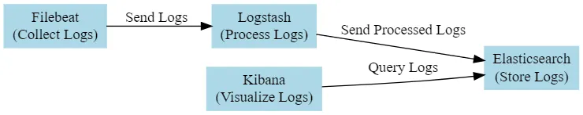
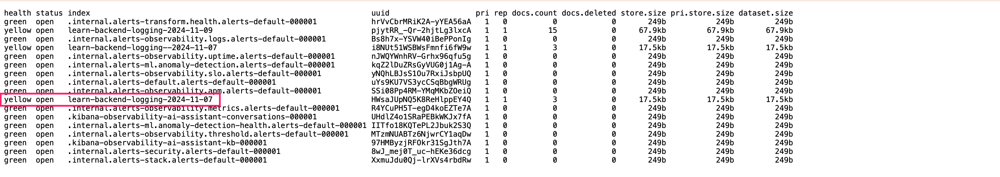
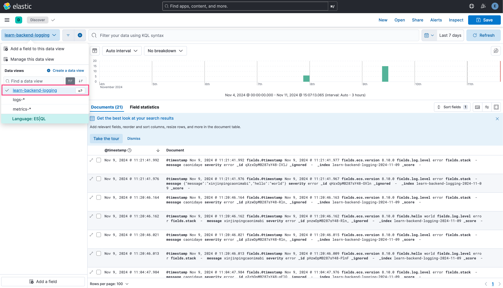

# Learning Backend

1. **User Service**: Responsible for handling user registration, login, and personal information management.
2. **Product Service**: Responsible for handling CRUD operations for products and inventory management.
3. **Order Service**: Responsible for handling order creation, payment, shipping, and refund processes.
   - Notify payment microservice:
     - if success:
       - Remove the relative items in shopping cart
       - Reduce storage
       - Send notification
     - if failure:
       - Send notification
4. **Cart Service**: Responsible for handling the creation of shopping carts, adding products, and removing products.
5. **Recommendation Service**: Responsible for recommending products based on user's purchase history and preferences.
6. **Search Service**: Responsible for handling product search functionality.
7. **Payment Service**: Responsible for handling order payments, integrating with third-party payment platforms like Alipay, WeChat Pay, etc.
8. **Notification Service**: Responsible for sending information about order status changes, event notifications, and more.

## Environment Variables

```bash
RABBITMQ_URI=<YOUR_RABBITMQ_URI>
ETCD_HOSTS=<YOUR_ETCD_HOSTS>
ETCD_USERNAME=<YOUR_ETCD_USERNAME>
ETCD_PASSWORD=<YOUR_ETCD_PASSWORD>
REDIS_URL=<YOUR_REDIS_URL>
ELASTIC_SEARCH_NODE=<YOUR_ELASTIC_SEARCH_NODE>
ELASTIC_SEARCH_USERNAME=<YOUR_ELASTIC_SEARCH_USERNAME>
ELASTIC_SEARCH_PASSWORD=<YOUR_ELASTIC_SEARCH_PASSWORD>
```

## RabbitMQ

### Visual Management

Run visual management service.

```bash
/usr/sbin/rabbitmq-plugins enable rabbitmq_management
```

The URL is [http://localhost:15672/](http://localhost:15672/), and the default username and password are both `guest`.


## GRPC & Protocol Buffers

Learn Protocol Buffers grammar from [Protocol Buffers Documentation](https://protobuf.dev/).

Use [`protoc`](https://grpc.io/docs/protoc-installation/) and [`ts-protoc`](https://github.com/stephenh/ts-proto) compile protobuf files to TypeScript interfaces.

Use the vscode plugin [Clang-Format](https://marketplace.visualstudio.com/items?itemName=xaver.clang-format) to **format** the `.proto` files and use the vscode plugin [vscode-proto3](https://marketplace.visualstudio.com/items?itemName=zxh404.vscode-proto3) to **highlight** the `.proto` files.

## ELK with Nest.js and Winston



### Install ELK

- [Install Elasticsearch with Docker](https://www.elastic.co/guide/en/elasticsearch/reference/current/docker.html)
- [Running the Elastic Stack ("ELK") on Docker](https://www.elastic.co/guide/en/elastic-stack-get-started/current/get-started-stack-docker.html)
- [Running Logstash on Docker](https://www.elastic.co/guide/en/logstash/current/docker.html)
- [NodeJS Series: Episode 9: Logging with Winston, Morgan and ELK Stack: Elasticsearch, Logstash, Kibana](https://medium.com/@darshana-edirisinghe/nodejs-series-episode-9-logging-with-winson-morgan-and-elk-stack-elasticsearch-logstash-f7c9b95f1d3c)

### Nest Winston configuration

```ts
new ElasticsearchTransport({
  level: 'error',
  indexPrefix: `learn-backend-logging`,
  indexSuffixPattern: 'YYYY-MM-DD',
  clientOpts: {
    node: [process.env.ELASTIC_SEARCH_NODE],
    maxRetries: 5,
    requestTimeout: 10000,
    sniffOnStart: false,
    auth: {
      username: process.env.ELASTIC_SEARCH_USERNAME,
      password: process.env.ELASTIC_SEARCH_PASSWORD
    },
    // [ONLY DEV SERVER] If not `false` a server automatically reject clients with invalid certificates.
    tls: { rejectUnauthorized: false } 
  }
})
```

### Kibana configuration

1. Submit some logs in advance to let ElasticSearch generate **index**, visit [https://localhost:9200/_cat/indices?v](https://localhost:9200/_cat/indices?v) to check whether your index successfully added.

2. Visit [http://localhost:5601/app/management/kibana/dataViews](http://localhost:5601/app/management/kibana/dataViews) to create data view, the `index pattern` matches the `indexPrefix` you configured.

3. Finally visit [http://localhost:5601/app/discover](http://localhost:5601/app/discover) and select your data view, and the logs will be displayed on the right panel.


## ETCD

## Kafka

## Docker

## Docker Compose

## K8S
