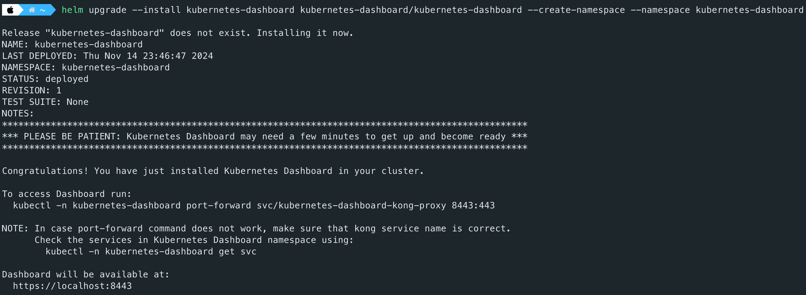
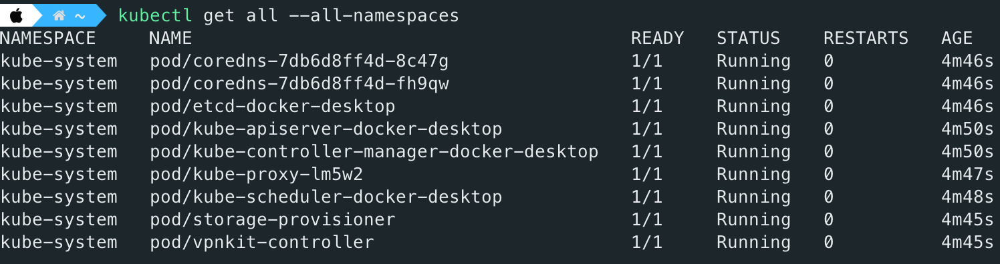
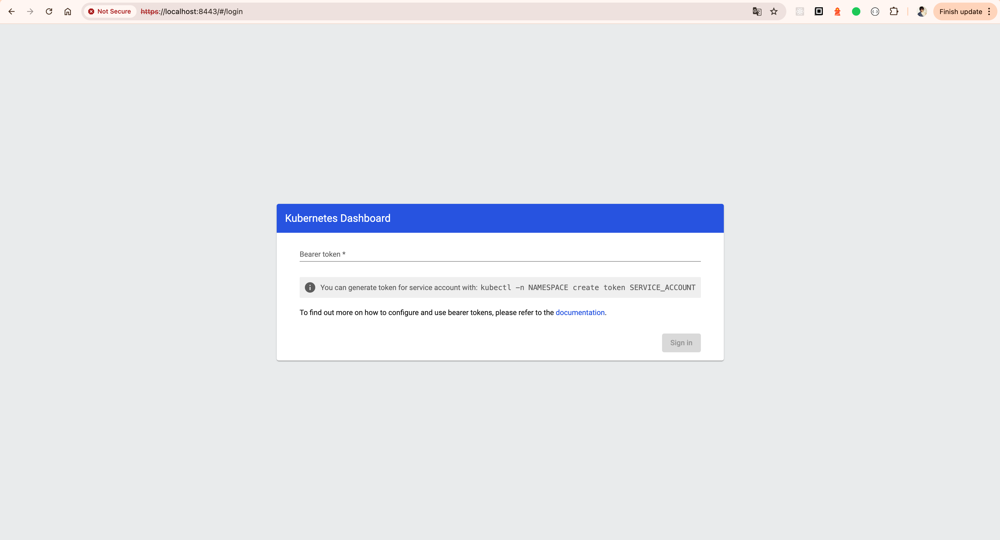

# Kubernetes

## Kubernetes Dashboard

> Kubernetes Dashboard supports only Helm-based installation currently. Many courses on the Internet have been outdated.

### Installing

```bash
# Add kubernetes-dashboard repository
helm repo add kubernetes-dashboard https://kubernetes.github.io/dashboard/

# Deploy a Helm Release named "kubernetes-dashboard" using the kubernetes-dashboard chart
helm upgrade --install kubernetes-dashboard kubernetes-dashboard/kubernetes-dashboard --create-namespace --namespace kubernetes-dashboard
```



Once Kubernetes Dashboard is installed, you can verify it using the following command:

```bash
kubectl get svc -n kubernetes-dashboard
```



### Creating Account and Token

> Follow the [instruction](https://github.com/kubernetes/dashboard/blob/master/docs/user/access-control/creating-sample-user.md).

First, create a Kubernetes manifest file to create a service account. For example:

```bash
apiVersion: v1
kind: ServiceAccount
metadata:
  name: admin-user
  namespace: kube-system
---
apiVersion: rbac.authorization.k8s.io/v1
kind: ClusterRoleBinding
metadata:
  name: admin-user
roleRef:
  apiGroup: rbac.authorization.k8s.io
  kind: ClusterRole
  name: cluster-admin
subjects:
- kind: ServiceAccount
  name: admin-user
  namespace: kube-system
```

Next, apply the above configuration to the Kubernetes cluster.

```bash
kubectl create -f k8s-dashboard-account.yaml
```

Next, generate a token using the following command:

```bash
kubectl -n kube-system create token admin-user
```

### Starting Kubernetes Dashboard Server

```bash
kubectl -n kubernetes-dashboard port-forward svc/kubernetes-dashboard-kong-proxy 8443:443
```

Finally, fill out your token on the field.


