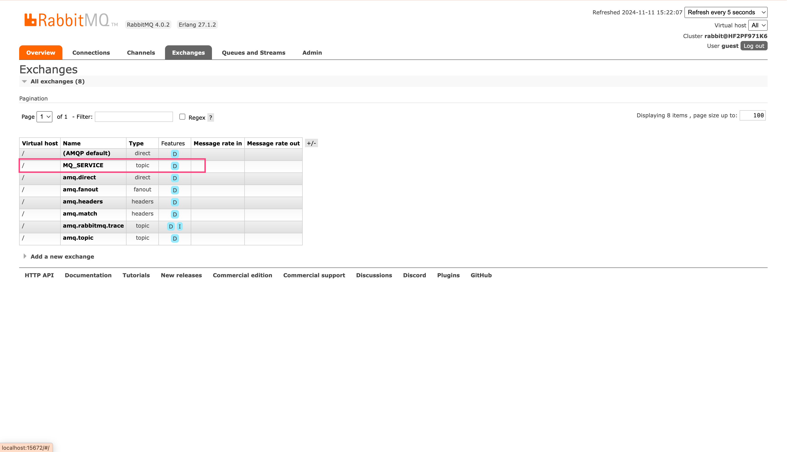

# RabbitMQ

## Visual Management

Run visual management service.

```bash
/usr/sbin/rabbitmq-plugins enable rabbitmq_management
```

The URL is [http://localhost:15672/](http://localhost:15672/), and the default username and password are both `guest`.


