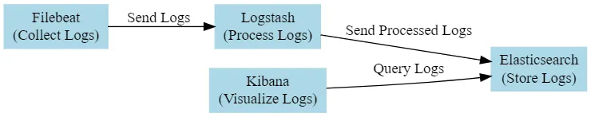
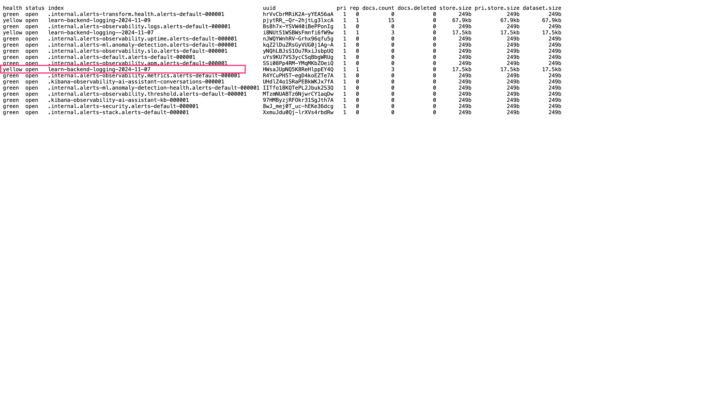
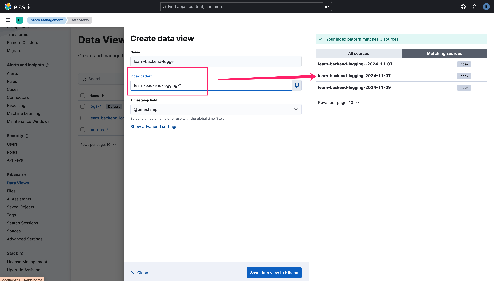
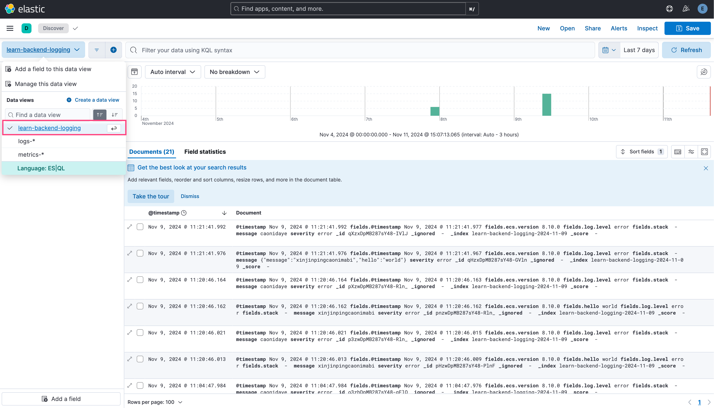

# ELK



## Install ELK

- [Install Elasticsearch with Docker](https://www.elastic.co/guide/en/elasticsearch/reference/current/docker.html)
- [Running the Elastic Stack ("ELK") on Docker](https://www.elastic.co/guide/en/elastic-stack-get-started/current/get-started-stack-docker.html)
- [Running Logstash on Docker](https://www.elastic.co/guide/en/logstash/current/docker.html)
- [NodeJS Series: Episode 9: Logging with Winston, Morgan and ELK Stack: Elasticsearch, Logstash, Kibana](https://medium.com/@darshana-edirisinghe/nodejs-series-episode-9-logging-with-winson-morgan-and-elk-stack-elasticsearch-logstash-f7c9b95f1d3c)

## Nest Winston configuration

```ts
new ElasticsearchTransport({
  level: 'error',
  indexPrefix: `learn-backend-logging`,
  indexSuffixPattern: 'YYYY-MM-DD',
  clientOpts: {
    node: [process.env.ELASTIC_SEARCH_NODE],
    maxRetries: 5,
    requestTimeout: 10000,
    sniffOnStart: false,
    auth: {
      username: process.env.ELASTIC_SEARCH_USERNAME,
      password: process.env.ELASTIC_SEARCH_PASSWORD
    },
    // [ONLY DEV SERVER] If not `false` a server automatically reject clients with invalid certificates.
    tls: { rejectUnauthorized: false } 
  }
})
```

## Kibana configuration

1. Submit some logs in advance to let ElasticSearch generate **index**, visit [https://localhost:9200/_cat/indices?v](https://localhost:9200/_cat/indices?v) to check whether your index successfully added.

2. Visit [http://localhost:5601/app/management/kibana/dataViews](http://localhost:5601/app/management/kibana/dataViews) to create data view, the `index pattern` matches the `indexPrefix` you configured.

3. Finally visit [http://localhost:5601/app/discover](http://localhost:5601/app/discover) and select your data view, and the logs will be displayed on the right panel.


## KQL

- message:hello
- message:hel*
- message_*:hello
- flight_num:T*V
- number>=100
- @timestamp>2024-11-14
- name:Yancey and addr:Tokyo
- name:Yancey or addr:Tokyo
- not response:200
- response:400 and not ARGUMENT_ERROR
- level1.level2 { prop1: "foo" or prop1: "baz" }
