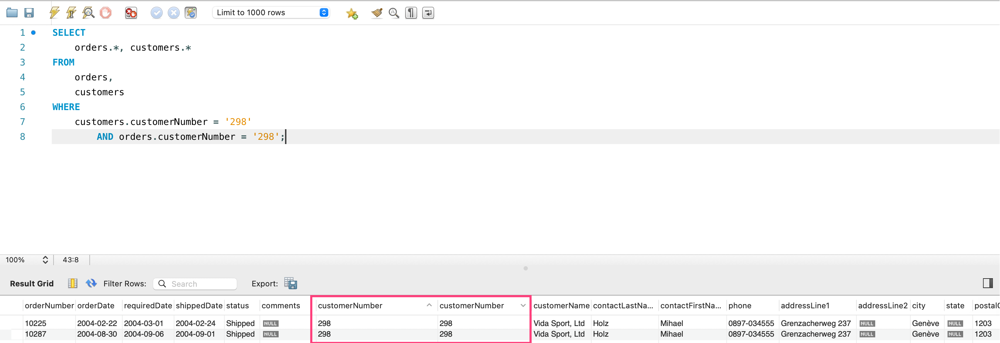

# join

如下代码, 我们想从 orders 和 customers 两张表中取出所有字段, 那么 FROM 就要把这两个表都选上.

需要注意的是, 这种写法计算出来的是笛卡尔积, 也就说如果 orders 表有 10 行, customers 中有 20 行, 如果不做任何 WHERE 限制, 它会生成 200 行数据.

下面这个例子, 我们把  customers.customerNumber orders.customerNumber 都固定到 298, 那么它的意义就变成了从 orders 和 customers 两张表中取出所有字段, 当且仅当 customerNumber 是 298 的时候.

```sql
SELECT 
    orders.*, customers.*
FROM
    orders,
    customers
WHERE
    customers.customerNumber = '298'
        AND orders.customerNumber = '298';
```

## 等值联结(内部联结)

这种查询基于两个表之间的相等测试, 叫做等值联结(equijoin), 这种联结也称为内部联结, 你也可以把上面的例子写成下面的形式:

```sql
SELECT 
    orders.*, customers.*
FROM
    orders
        INNER JOIN
    customers ON customers.customerNumber = '298'
        AND orders.customerNumber = '298';
```

## 联结多个表

下面这个例子找出购买 S24_2360 这款产品的所有订单, 然后找出这些订单的客户, 最后找出服务这个客户的员工信息.

```sql
SELECT DISTINCT
    employees.*
FROM
    orderdetails,
    orders,
    customers,
    employees
WHERE
    orderdetails.productCode = 'S24_2360'
        AND orderdetails.orderNumber = orders.orderNumber
        AND orders.customerNumber = customers.customerNumber
        AND employees.employeeNumber = customers.salesRepEmployeeNumber;
```

## 表别名

除了给 select 的字段加别名, 也可以给表加别名, 这样可以减少 SQL 语句的长度, 我们可以改造下上面这个例子:

```sql
/* from 里面的表名用了别名, 一定要注意 select 和 where 都要用别名, 真实名在这个 SQL 语句中就不能用了 */
SELECT DISTINCT
    e.*
FROM
    orderdetails AS od,
    orders AS o,
    customers AS c,
    employees AS e
WHERE
    od.productCode = 'S24_2360'
        AND od.orderNumber = o.orderNumber
        AND o.customerNumber = c.customerNumber
        AND e.employeeNumber = c.salesRepEmployeeNumber;
```

## 自联结

下面这个例子, 先找出订单号为 10100 的供应商, 再反查该供应商下的所有订单. 这种只在一张表多重操作的场景, 可以用到自联结. 自联结必定要用到表别名.

```sql
SELECT 
    o1.*
FROM
    orders AS o1,
    orders AS o2
WHERE
    o1.customerNumber = o2.customerNumber
        AND o2.orderNumber = 10100
```

## 自然联结

这个了解下就好, 比如文章开头的例子, 因为表联合, 必然会出现至少一个字段重复. 自然联结的意思就是让你**手动**把重复字段消除.



## 外部联结

不太好解释, 直接看例子吧.

- customers 表总有 122 名客户, 其中有 22 名客户没有配客服员工
- employees 表总共有 23 名员工, 其中有 15 名员工为客户服务, 另外 8 个是吃干饭的
-

下面这个 SQL 匹配客户与员工, 所以能匹配的共有 122 - 22 = 100

```sql
SELECT
    COUNT(*),
FROM
    customers
        INNER JOIN
    employees ON customers.salesRepEmployeeNumber = employees.employeeNumber
```

下面这个 SQL 匹配客户与员工, 因为是 LEFT OUTER, 所以在上面 100 条匹配到的基础上, **加上 customers 表没匹配上的**, 也就是加上那 22 名没有配客服员工客户, 所以共有 100 + 22 = 122

```sql
SELECT 
    COUNT(*),
FROM
    customers
        LEFT OUTER JOIN
    employees ON customers.salesRepEmployeeNumber = employees.employeeNumber
```

下面这个 SQL 匹配客户与员工, 因为是 RIGHT OUTER, 所以在上面 100 条匹配到的基础上, **加上 employees 表没匹配上的**, 也就是加上那 8 个吃干饭的员工, 所以共有 100 + 8 = 108

```sql
SELECT 
    COUNT(*),
FROM
    customers
        LEFT OUTER JOIN
    employees ON customers.salesRepEmployeeNumber = employees.employeeNumber
```
