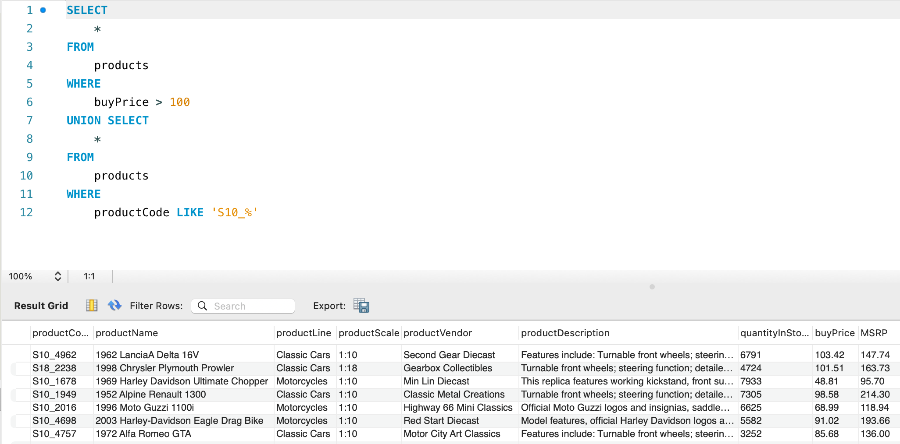
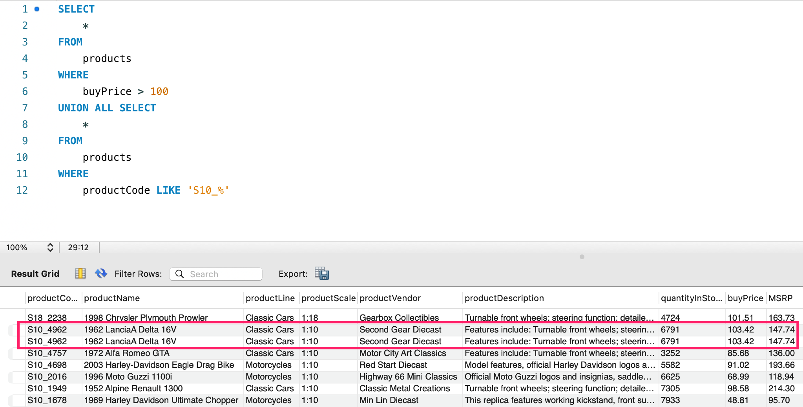

# union

多数 SQL 查询都只包含从一个或多个表中返回数据的单条 SELECT 语句. MySQL 也允许执行多个查询(多条 SELECT 语句), 并将结果作为单个查询结果集返回. 这些组合查询通常称为并(union)或复合查询(compound query).

有两种基本情况, 其中需要使用组合查询:


- 在单个查询中从不同的表返回类似结构的数据
- 对单个表执行多个查询, 按单个查询返回数据

下面这个例子就相当于找出购买价格大于 100 的商品, **或者**产品 ID 以 S10_ 开头的, 注意一定是**或者**.

```sql
 SELECT 
    *
FROM
    products
WHERE
    buyPrice > 100 
UNION SELECT 
    *
FROM
    products
WHERE
    productCode LIKE 'S10_%'
```

在这里例子使用UNION可能比使用 WHERE 子句更为复杂. 但对于更复杂的过滤条件, 或者从多个表(而不是单个表)中检索数据的情形, 使用 UNION 可能会使处理更简单.

```sql
SELECT 
    *
FROM
    products
WHERE
    buyPrice > 100
        OR productCode LIKE 'S10_%'
```

## UNION 规则

- UNION 必须由两条或两条以上的 SELECT 语句组成, 语句之间用关键字 UNION 分隔.
- UNION 中的每个查询必须包含相同的列, 表达式或聚集函数(不过各个列不需要以相同的次序列出).
- 列数据类型必须兼容: 类型不必完全相同, 但必须是 DBMS 可以隐含地转换的类型(例如, 不同的数值类型或不同的日期类型)

## 包含或取消重复的行

union 意味着取并集, 但默认会去重.



如果你不想去重, 可以用 `UNION ALL`



## union 遇上 orderby

如果在 union 使用 orderby, 必须仅将 orderby 放在最后一个子句之后

```sql
SELECT 
    *
FROM
    products
WHERE
    buyPrice > 100 
UNION ALL SELECT 
    *
FROM
    products
WHERE
    productCode LIKE 'S10_%'
ORDER BY buyPrice DESC
```
